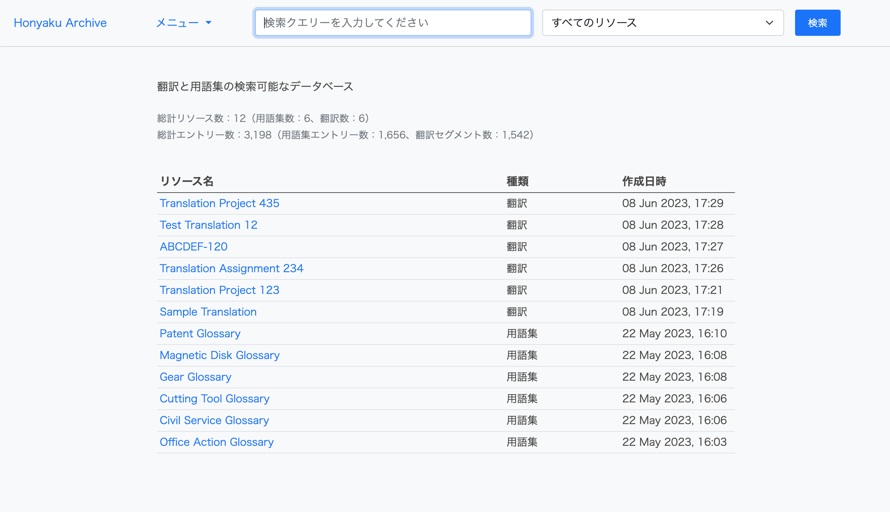
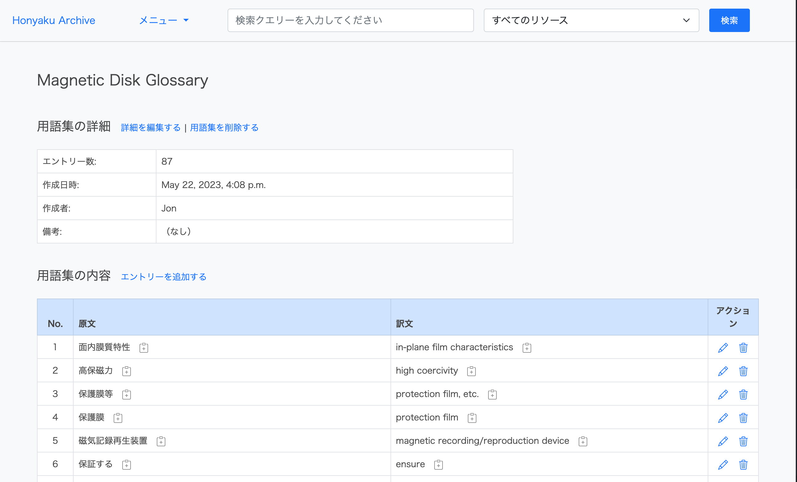
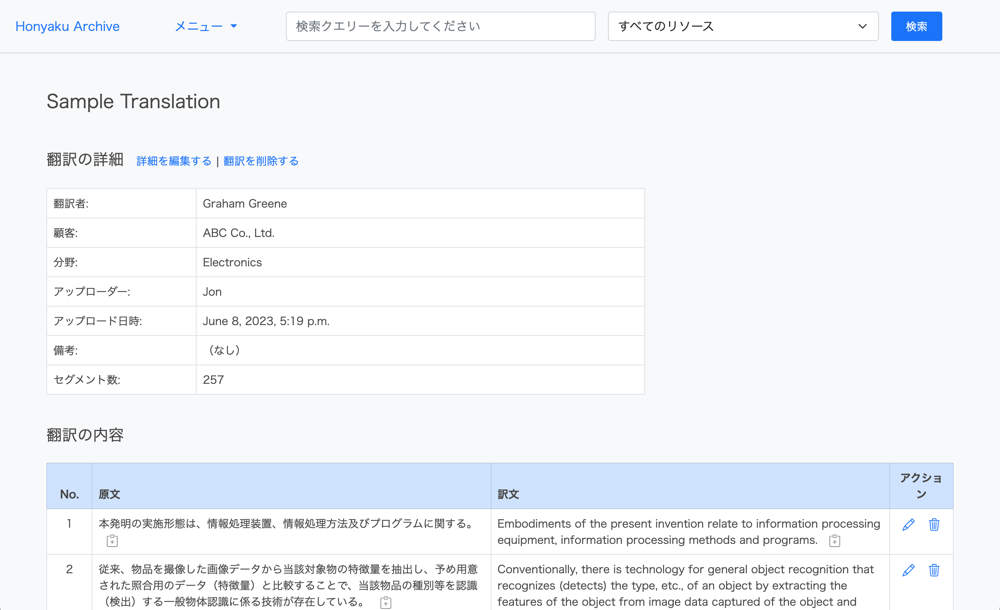
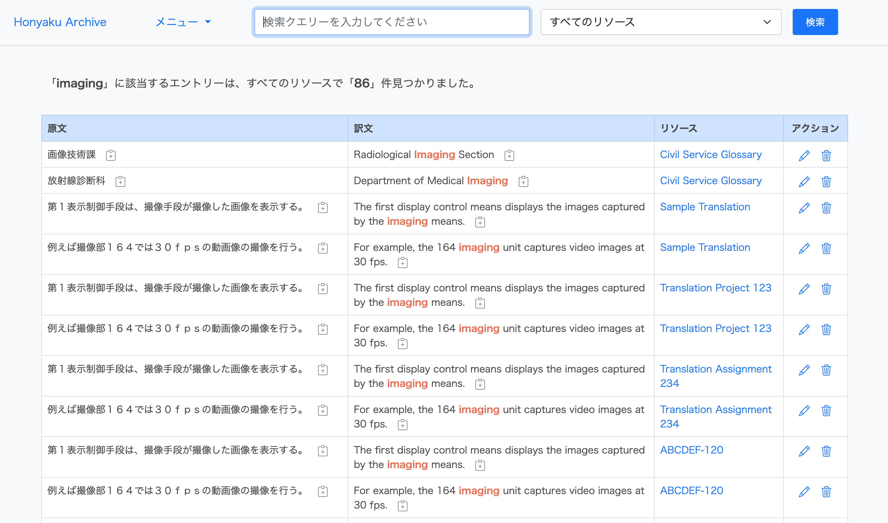
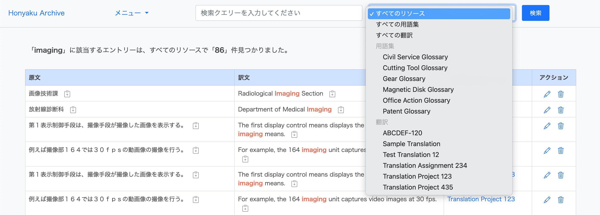
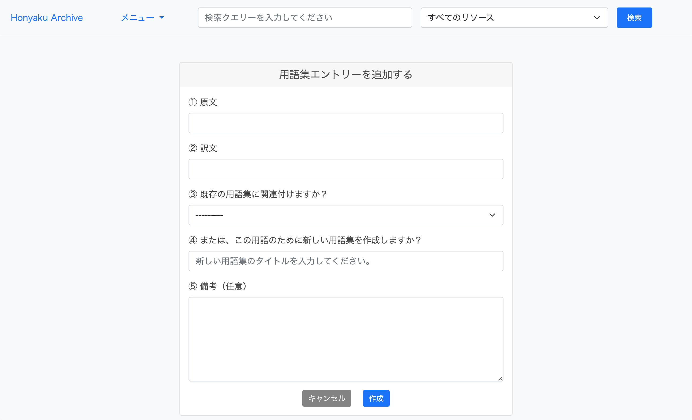
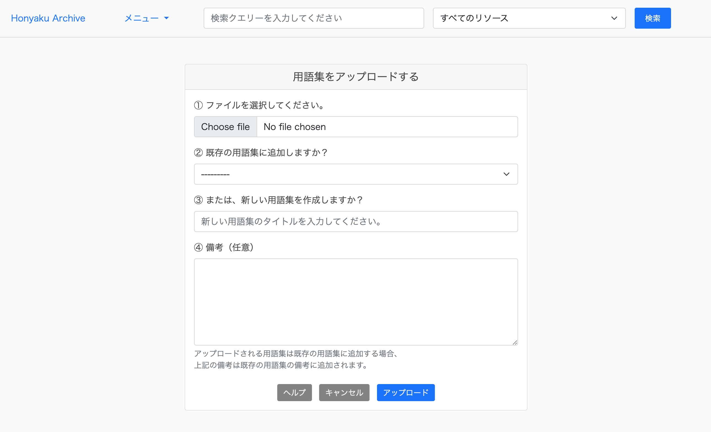
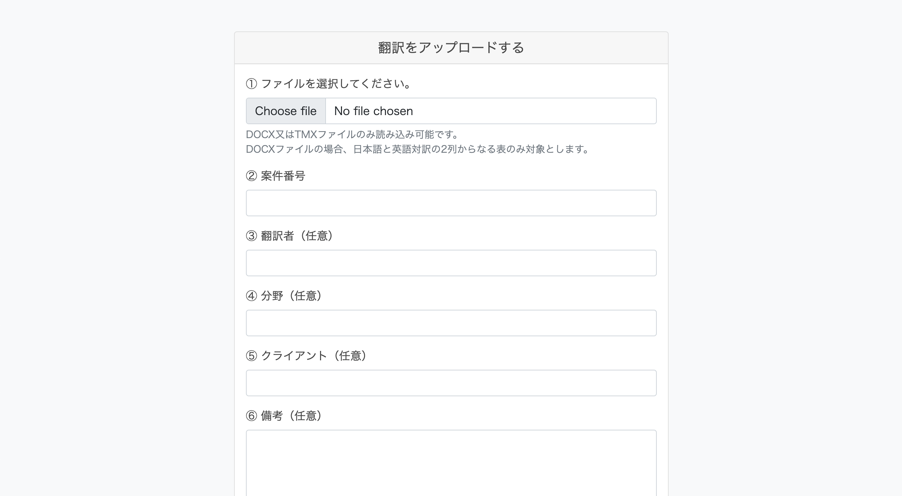

# Honyaku Archive

A webapp for archiving and searching translations and glossaries.

You can do the following:
* Search the content of glossaries and translations.
* Upload, create, edit, and delete glossaries (upload format: .txt files).
* Upload, edit, and delete translations (upload format: .tmx and .docx files).

### Built using:

* Python 3.10
* Django 4.1.3
* Bootstrap 5

### Screenshots

Home page:</br></br>
</br></br>

Glossary detail page:</br></br>
</br></br>

Translation detail page:</br></br>
</br></br>

Search results:</br></br>
</br></br>

Search options:</br></br>
</br></br>

Add glossary entry form:</br></br>
</br></br>

Upload glossary form:</br></br>
</br></br>

Upload translation form:</br></br>
</br></br>

## To download and run

1. Clone this repo into a location of your choosing.<br>
`git clone https://github.com/4ka0/honyaku_archive.git`

2. Move into the project folder.<br>
`cd honyaku_archive`

3. Create and activate a virtual environment.<br>
(Example using venv:)<br>
`python3 -m venv venv`<br>
`source venv/bin/activate`

4. Update pip (package manager).<br>
`python -m pip install --upgrade pip`

5. Install the dependencies.<br>
`python -m pip install -r requirements.txt`

Environment variables are intentionally separated from the codebase.<br>
Therefore, in the root directory of the project, create a file called `.env`.<br>
In the `.env` file, write the following lines (defining the necessary environment variables).<br>
```
export DEBUG=True
export ALLOWED_HOSTS=127.0.0.1
export DATABASE_URL=sqlite:///db.sqlite3
export SECRET_KEY=
```
For the SECRET_KEY value, after the equals sign and without a space, add a sequence of characters that is:
- a minimum of 50 characters in length, and
- contains a minimum of 5 unique characters.

(Or simply use this site to generate one => https://djecrety.ir)

6. Set up the database.<br>
`python manage.py migrate`

7. Create a user.<br>
`python manage.py createsuperuser`

8. Run the local server.<br>
`python manage.py runserver`

9. Access `127.0.0.1:8000` in your browser.<br>

10. Log in using the same user credentials that you just created in step 7, and start adding glossaries and translations.<br>
